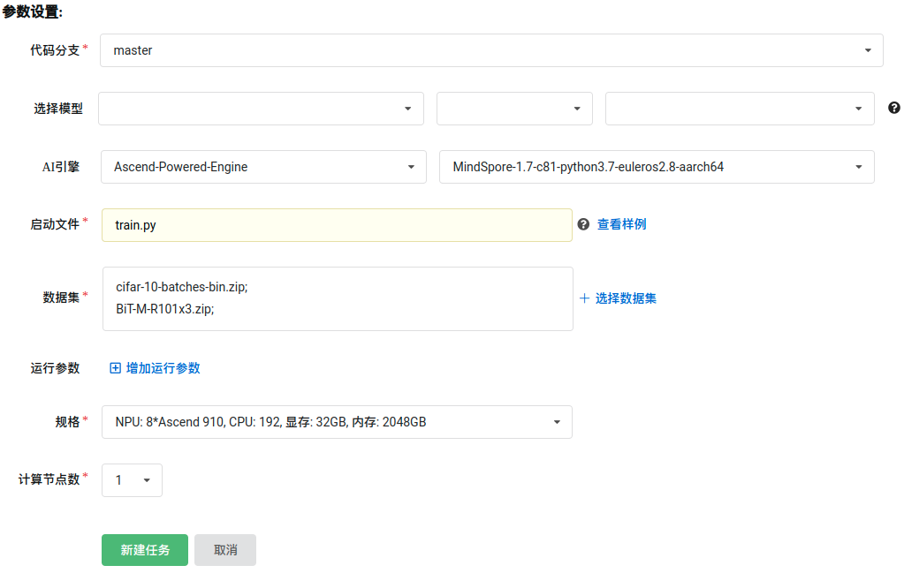
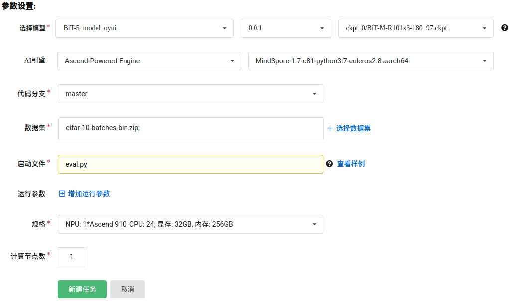

# 目录

<!-- TOC -->

- [目录](#目录)
- [BigTransfer描述](#BigTransfer描述)
- [数据集](#数据集)
- [特性](#特性)
    - [混合精度](#混合精度)
- [环境要求](#环境要求)
- [代码说明](#代码说明)
    - [代码列表](#代码列表)
    - [训练超参数](#训练超参数)
- [训练和测试](#训练和测试)
    - [训练模型](#训练模型)
        - [测试模型](#测试模型)
- [模型描述](#模型描述)
    - [性能](#性能)
        - [评估性能](#评估性能)
<!-- - [ModelZoo主页](#modelzoo主页) -->

<!-- /TOC -->

# [BigTransfer描述](#目录)
视觉神经网络模型，可以使用预训练模型的迁移学习提升样本效率并简化超参数调优。对此，Google Research, Brain Team 提出了一个简单有效的方案，称之为 Big Transfer (BiT)。BiT 在超过 20 个数据集上实现了强大的性能，并在不同数据规模上：从每类一个样本直到合计一百万样本，表现优异。

# [数据集](#目录)

使用的数据集：[CIFAR-10](https://www.cs.toronto.edu/~kriz/cifar.html)

- 数据集大小：共 10 类
    - 训练集：共 50,000 张图像
    - 测试集：共 10,000 张图像
- 数据格式：binary
    - 注：数据在 dataset.py 中处理。
- 下载数据集，目录结构如下：

 ```bash
cifar-10-batches-bin
├── batches.meta.txt
├── data_batch_1.bin               # 训练数据集
├── data_batch_2.bin               # 训练数据集
├── data_batch_3.bin               # 训练数据集
├── data_batch_4.bin               # 训练数据集
├── data_batch_5.bin               # 训练数据集
├── readme.html
└── test_batch.bin                 # 测试数据集
```

# [特性](#目录)

## 混合精度

采用[混合精度](https://www.mindspore.cn/tutorials/zh-CN/master/advanced/mixed_precision.html)的训练方法，使用支持单精度和半精度数据来提高深度学习神经网络的训练速度，同时保持单精度训练所能达到的网络精度。混合精度训练提高计算速度、减少内存使用的同时，支持在特定硬件上训练更大的模型或实现更大批次的训练。

# [环境要求](#目录)

- 硬件（Ascend）
    - 使用 Ascend 来搭建硬件环境。
- 框架
    - [MindSpore](https://www.mindspore.cn/install/en)
- 如需查看详情，请参见如下资源：
    - [MindSpore教程](https://www.mindspore.cn/tutorials/zh-CN/master/index.html)
    - [MindSpore Python API](https://www.mindspore.cn/docs/api/zh-CN/master/index.html)

# [代码说明](#目录)

## 代码列表

```bash
BigTransfer
├── src
│   ├── model_utils                # 训练环境相关处理
│   │   ├── config.py              # 配置文件处理
│   │   ├── device_adapter.py      # 自动选取 ModelArts 或本地训练相关处理
│   │   ├── __init__.py
│   │   ├── local_adapter.py       # 本地训练相关处理
│   │   └── moxing_adapter.py      # ModelArts 训练相关处理
│   ├── callbacks.py               # 监测训练信息
│   ├── cell_wrapper.py            # 自定义混合精度训练
│   ├── dataset.py                 # 数据集读取
│   ├── metrics.py                 # 计算评估指标
│   ├── models.py                  # 模型定义
│   ├── padding.py                 # pad 算子定义
│   ├── rand_augment.py            # RandAugment 数据增强
│   └── utils.py                   # 学习率、模型载入等工具
├── default_config.yaml            # 配置文件
├── eval.py                        # 评估程序
├── LICENSE
├── README.md                      # BigTransfer 相关说明
└── train.py                       # 训练程序
```

## 训练超参数

在 default_config.yaml 中可以配置训练和评估参数。

配置 BiT-M-R101x3 模型和 CIFAR-10 数据集。

### 训练阶段主要参数
  ```yaml
    # === 数据集设置 ===
    num_classes: 10                  # 数据集分类数目
    image_height: 160                # 输入图片高度
    image_width: 160                 # 输入图片宽度
    num_parallel_workers: 16         # 数据处理并行数
    batch_size: 64                   # 每个 device 上的 batch 大小 (16 卡时为 32)
    rand_augment_num_layers: 2       # RandAugment 操作的算子数量
    rand_augment_magnitude: 20       # RandAugment 操作的增强强度
    mixup_alpha: 0.5                 # MixUp 中 β 分布的参数

    # === 网络训练设置 ===
    num_epochs: 200                  # 训练轮数
    lr_init: 0.02                    # 初始学习率
    lr_decay: 0.98                   # 学习率递减率
    lr_warmup_epochs: 6.0            # 学习率热身轮数
    lr_num_epochs_per_decay: 2.5     # 学习率递减间隔轮数
    momentum: 0.9                    # RMSProp 优化器参数
    decay: 0.9                       # RMSProp 优化器参数
    weight_decay: 0.00004            # RMSProp 优化器参数
    enable_ema: True                 # 启用 Exponential Moving Average (EMA)
    ema_decay: 0.9999                # EMA 参数
    enable_clip_norm: True           # 启用梯度模长限制
    gradient_norm: 1.0               # 梯度模长参数
    label_smoothing: 0.1             # 标签平滑参数
  ```

更多配置细节请参考配置文件 default_config.yaml。在启智集群上可以按照如下步骤进行训练和评估：

# [训练和测试](#目录)

## 训练模型

## 测试模型


# [模型描述](#目录)

## 性能

### 评估性能

#### CIFAR-10 上的 BiT-M-R101x3 模型

| 参数 | Ascend 910 |
| ---- | ---- |
| 模型 | BigTransfer |
| 模型版本| BiT-M-R101x3 |
| 资源 | Ascend 910 |
| 上传日期 | 2022-11-03 |
| MindSpore版本 | 1.7 |
| 数据集 | CIFAR-10 train / test，共 50,000 / 10,000 张图像，共 10 类别 |
| 训练参数 | epoch=200, batch_size=64 |
| 优化器 | RMSProp |
| 损失函数 | SoftmaxCrossEntropyWithLogits |
| 损失 | 1.19 |
| 分类准确率 | 8卡 训练 Top1 Acc: 99.30% / 99.21% / 99.25% （三次实验）|
| 速度 | 8卡 训练 949.0 毫秒每步 |
| 训练耗时 （启智集群） | 5:36:12 |

<!-- # ModelZoo主页

请浏览官网[主页](https://gitee.com/mindspore/models) -->